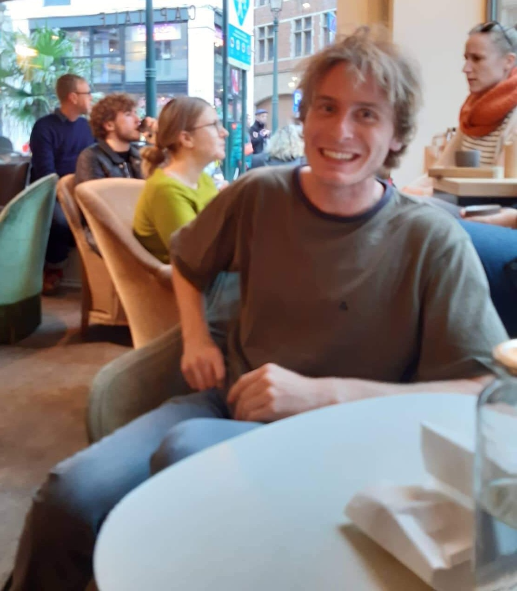

Hi, I'm Joe. I live in Newcastle, Australia.

In these trying times I'd like to help supplement your or your child's mathematics education. I am offering digital tutoring sessions in year 8-12 maths (at any level of difficulty). I have a lot of experience with HSC prep tutoring in particular and thoroughly enjoy it.

I am offering zoom sessions where I'll be able to draw maths on the
student's screen and for them to fully participate. I am offering
sessions at **\$30 for half an hour** and
**\$60 for an hour**. I understand that this is a
very difficult time for many people financially, I do not want these
prices to be a barrier. If you are interested in this service but
cannot afford these prices I am happy to discuss possible options and
solutions. The first session might run approximately 10-20 minutes
longer than this to iron out any kinks.

If you are interested in this or have any questions please send me an
email at **joe.gurr.tutor@gmail.com** and I'll get back to you as soon as possible.

For those wondering, I look like this (my apologies for the
blurriness).

## Education

- I recently completed a Bachelor of Mathematics (majoring in pure mathematics) from the University of Newcastle with a GPA of 6.96 out of 7
- I completed the HSC in 2014. I received an ATAR of 98.40.
- The subjects I took in the HSC were Mathematics Extension 2, English (Advanced), Physics, Chemistry, Earth and Environmental Science, and Studies of Religion (1 Unit). I also took preliminary Geography in year 11.

## Experience

- I have been helping students with their school work since 2014. I have tutored students of all ages in maths, english, and science.
- I am passionate about helping my students find the right motivation for them and to help develop a study plan so that studying becomes less of a chore and something to enjoy and look forward to.

## Hobbies

- I'm quite an active person, I enjoy rock climbing, gymnastics, and yoga.
- I really enjoy travelling. Most recently I've spent a month in southern Poland exploring the natural environment there.
- Most of all I love to read (I'm one of a rare species who loves maths and english equally).
